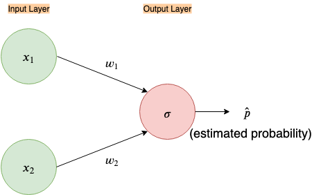
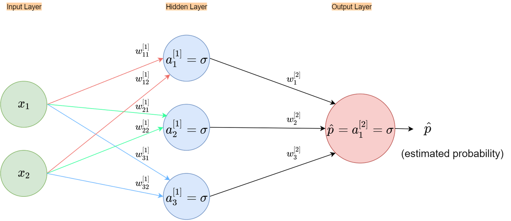
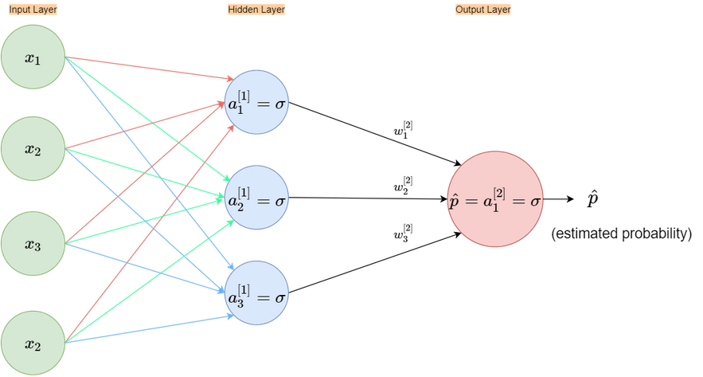
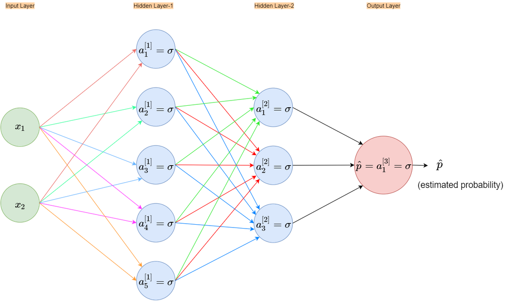

# Nothing But NumPy: _Understanding &amp; Creating Binary Classification Neural Networks with Computational Graphs from Scratch_
This repository is part of the blog post ["Nothing but NumPy: Understanding & Creating Binary Classification Neural Networks with Computational Graphs from Scratch"](https://medium.com/@rafayak/nothing-but-numpy-understanding-creating-binary-classification-neural-networks-with-e746423c8d5c)

   
***Forks rather than Clones, Stars rather than Views*** 🙏

### Layers
The ___Layers___ directory contains the classes for:
1. Linear Layer
2. Activation Layer:
   - Sigmoid Layer

### util
___util___ directory contains utility fuctions. It has the following files with the following functions:
1. paramInitializer.py

   - `initialize_parameters(n_in, n_out, ini_type='plain')`

2. utilities.py

   - `predict(X, Y, Zs, As, thresh=0.5)`
   - `plot_learning_curve(costs, learning_rate, total_epochs, save=False)`
   - `predict_dec(Zs, As, X, thresh=0.5)`
   - `plot_decision_boundary(model, X, Y, feat_crosses=None, axis_lines=False,save=False)`
   - `plot_decision_boundary_shaded(model, X, Y, feat_crosses=None, axis_lines=False,save=False)`
   - `plot_decision_boundary_distances(model, X, Y, feat_crosses=None, axis_lines=False, save=False)`

3. cost_functions.py
   - `compute_bce_cost(Y, P_hat)`
   - `compute_stable_bce_cost(Y, Z)`
   - `compute_keras_like_bce_cost(Y, P_hat, from_logits=False)`
   - `compute_mse_cost(Y, Y_hat)`
   
   
---   

The following examples have been implemented:

1. [**A 1-layer neural network on AND data that uses MSE Cost**](1_layer_toy_network_MSE_AND_dataset.ipynb)

    This notebook shows how easy it is to break backpropagation when Mean Squared Error(MSE) Cost function is used in a
    binary classification setting. The following neural network architecture has been implemented:
    
    
    
    
2.  [**A 2-layer neural network on XOR data that uses Keras-like BCE Cost**](2_layer_toy_network_KerasLikeBCE_XOR.ipynb)

    This notebook trains a 2-layer neural net on XOR data using the Keras-like Binary Cross-Entropy(BCE) Cost function. 
    The following neural network architecture has been implemented:
    
    
    
3.  [**A 1-layer neural network on Iris flower petals data**](1_layer_toy_network_on_Iris_petals.ipynb)

    This notebook trains a 1-layer neural net to classify _"iris-versicolor flower vs. other flowers"_ using only petal length &
    width as features and the _"stable"_ BCE Cost function. The following neural network architecture has been implemented:
    
    
    
 
 4. [**A 2-layer neural network on all Iris flowers data**](2_layer_toy_neural_network_on_all_iris_data.ipynb)
 
    This notebook trains a 2-layer neural net to classify _"iris-versicolor flower vs. other flowers"_ using **all** of the 4 flower features and the _"stable"_ BCE Cost function. The following neural network architecture has been implemented:
    
    
    
    
 5. [**A 3-layer neural network on Iris flower sepals data**](3_layer_toy_neural_network_on_iris_sepals.ipynb)
 
 
    This notebook trains a 3-layer neural net to classify _"iris-versicolor flower vs. other flowers"_ using only sepal length & width as features and the _"stable"_ BCE Cost function. The following neural network architecture has been implemented:
    
     
    
    

***

Find me on [twitter](https://twitter.com/RafayAK) for any questions or suggestions.
 
 
    
  
