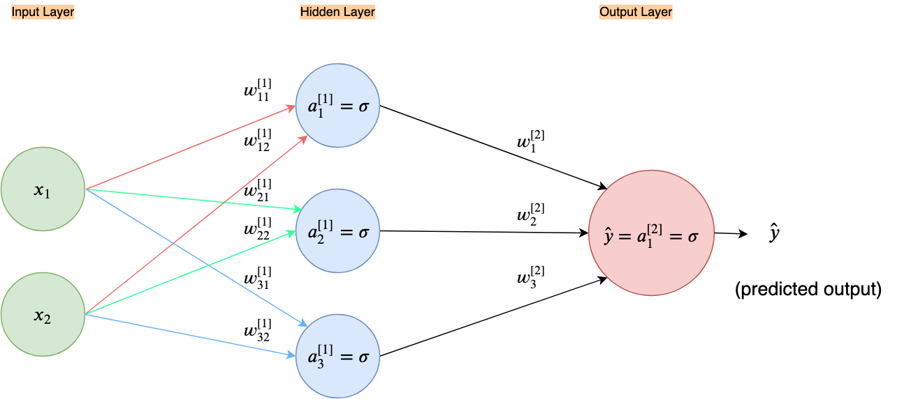
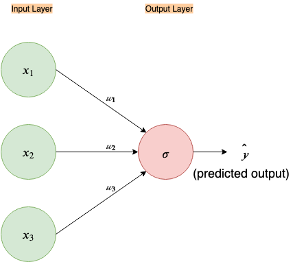

# _Nothing But NumPy_: Understanding &amp; Creating neural networks with computational graphs from scratch
This repository is part of the blog post ["Nothing but NumPy: Understanding &amp; Creating neural networks with computational graphs from scratch"](https://medium.com/@rafayak/nothing-but-numpy-understanding-creating-neural-networks-with-computational-graphs-from-scratch-6299901091b0)

   
***Forks rather than Clones, Stars rather than Views*** 🙏

### Layers
The ___Layers___ directory contains the classes for:
1. Linear Layer
2. Activation Layer:
   - Sigmoid Layer

### util
___util___ directory contains utility fuctions. It has the following files with the following functions:
1. paramInitializer.py

   - `initialize_parameters(n_in, n_out, ini_type='plain')`

2. utilities.py

   - `compute_cost(Y, Y_hat)`
   - `predict(X, Y, Zs, As)`
   - `plot_learning_curve(costs, learning_rate, total_epochs, save=False)`
   - `predict_dec(Zs, As, X)`
   - `plot_decision_boundary(model, X, Y, feat_crosses=None, save=False)`
   - `plot_decision_boundary_shaded(model, X, Y, feat_crosses=None, save=False)`
   
---   

As examples following neural network architectures have been implemented:

1. [__A 2-layer neural network on XOR data__](2_layer_toy_network_XOR.ipynb)

2. [__A 1-layer neural network with a feature cross on XOR data__](1_layer_toy_network_with_feature_cross_XOR.ipynb)

3. [__A 3-layer neural network on XOR data__](3_layer_neural_network_XOR.ipynb)

***

Find me on [twitter](https://twitter.com/RafayAK) for any questions or suggestions.
